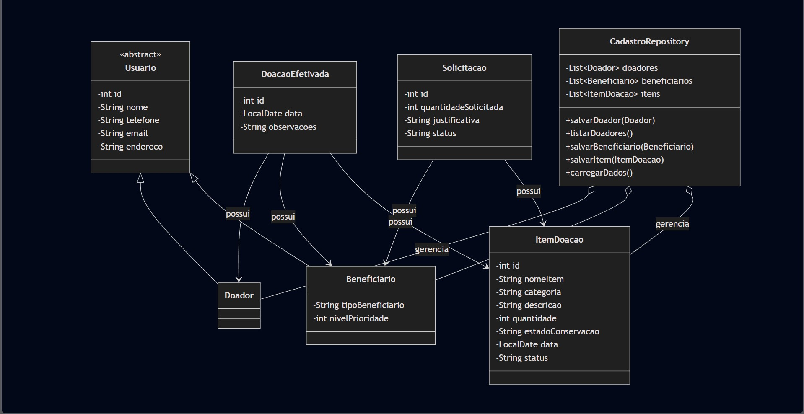
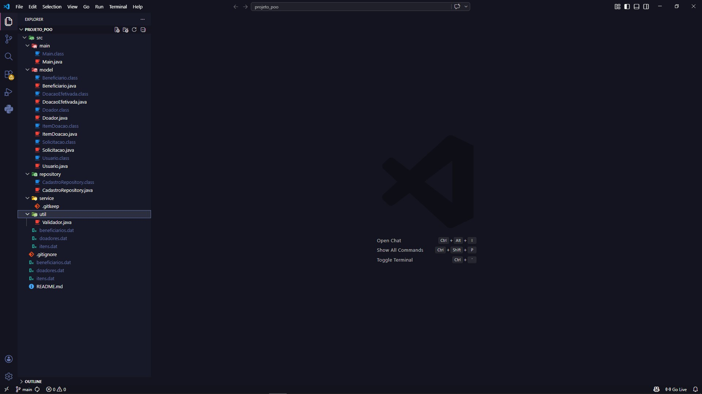
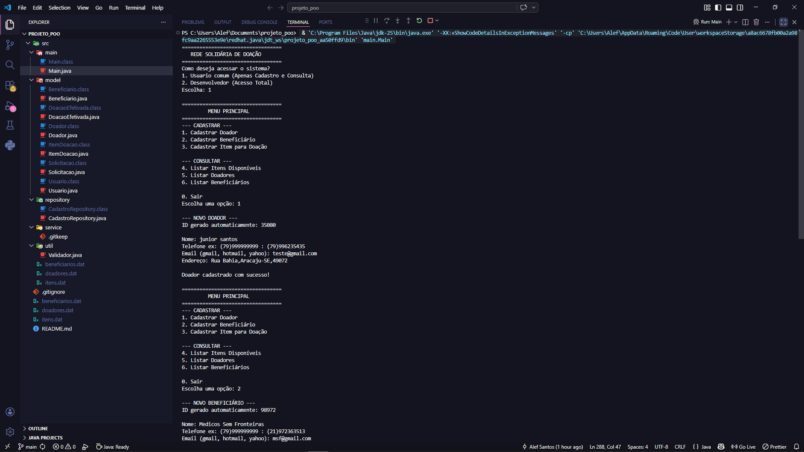
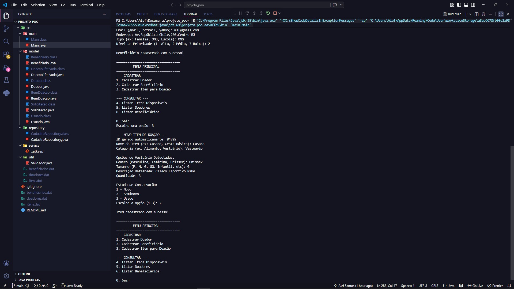
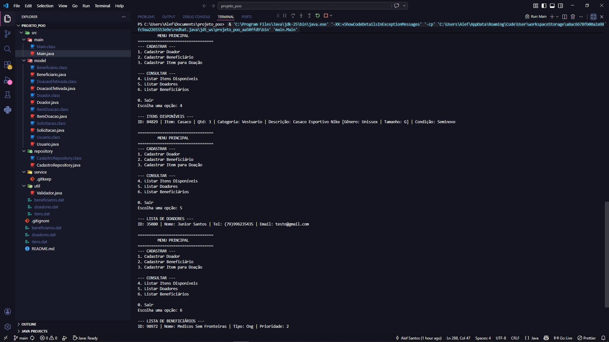
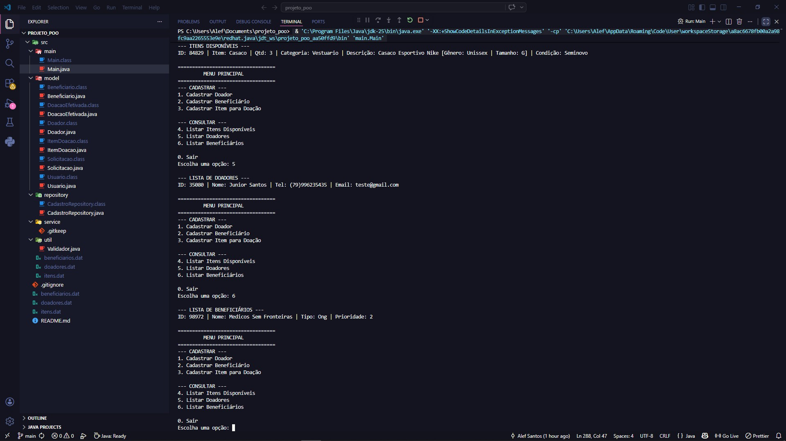

🤝 Rede Solidária de Doação - Java POO
==================================
Aplicação orientada a objetos desenvolvida em Java para apoiar o cadastro e gerenciamento de itens doados para pessoas e instituições em situação de necessidade. Este projeto visa conectar doadores e beneficiários, ajudando no reaproveitamento de recursos, e atende aos ODS 1, 2, 10 e 12 da ONU.

Projeto desenvolvido para fins acadêmicos - Foco: Checkpoint 1.

✨ O que o sistema faz (Checkpoint 1)
==================================
Cadastrar Doadores

Cadastrar Beneficiários (ONGs, famílias, escolas, etc.)

Cadastrar Itens para Doação

Listar dados salvos (Doadores, Beneficiários e Itens Disponíveis)

Salvar e carregar dados automaticamente ao abrir e fechar o programa.

📊 Diagrama de Classes (Modelagem)
==================================


🚀 Como usar
==================================
Pré-requisito: Ter o Java (JDK) instalado na máquina.

Clone o projeto:
```bash
git clone https://github.com/Alefsantos186/RedeSolidariaJava.git
cd RedeSolidariaJava/src
```

Compile os arquivos Java:
```bash
javac main/*.java model/*.java repository/*.java util/*.java
```

Execute o sistema:
```bash
java main.Main
```
📝 Exemplo prático:
Ao executar, você navegará por um menu interativo via CLI (linha de comando):
========================================
REDE SOLIDÁRIA DE DOAÇÃO
========================================
         Como deseja acessar o sistema?
         
         1. Usuario comum (Apenas Cadastro e Consulta)
         2. Desenvolvedor (Acesso Total)
         Escolha: 1
         
         MENU PRINCIPAL
         
         --- CADASTRAR ---
         1. Cadastrar Doador
         2. Cadastrar Beneficiário
         3. Cadastrar Item para Doação

         --- CONSULTAR ---
         4. Listar Itens Disponíveis
         5. Listar Doadores
         6. Listar Beneficiários
         
         0. Sair
         Escolha uma opção:

Persistência Local: Ao escolher a opção "0. Sair", o sistema varre as listas em memória e salva tudo em arquivos .dat locais de forma automática, garantindo que nenhum cadastro seja perdido.

📂 Estrutura do projeto
==================================
```text
src/
├── model/             # Classes de domínio
│   ├── Usuario.java         # Classe base
│   ├── Doador.java          # Herda de Usuario
│   ├── Beneficiario.java    # Herda de Usuario
│   ├── ItemDoacao.java      # Entidade de itens
│   ├── Solicitacao.java     # Registro de pedidos
│   └── DoacaoEfetivada.java # Registro de entregas concluídas
├── repository/        # Armazenamento e persistência
│   └── CadastroRepository.java 
├── service/           # Regras de negócio
├── util/              # Classes utilitárias e validações
│   └── Validador.java
└── main/              # Execução do sistema
    └── Main.java            # Menu principal CLI
```

📸 Evidências de Funcionamento (Checkpoint 1)
==================================
Estrutura de Pastas do Projeto


Execução no Terminal e Fluxo de Sistema
Aqui estão as evidências do menu principal e das funcionalidades de cadastro e consulta em operação:

**1. Acesso, Menu Principal e Cadastro de Doador:**


**2. Cadastro de Beneficiário e Itens:**


**3. Listagem de Itens e Doadores:**


**4. Listagem de Beneficiários e Encerramento:**


🛠️ Tecnologias
==================================
Java (Linguagem base)

Scanner (Entrada de dados via terminal)

ArrayList (Armazenamento em memória das entidades)

ObjectOutputStream / ObjectInputStream (Serialização de objetos para arquivos binários .dat)
