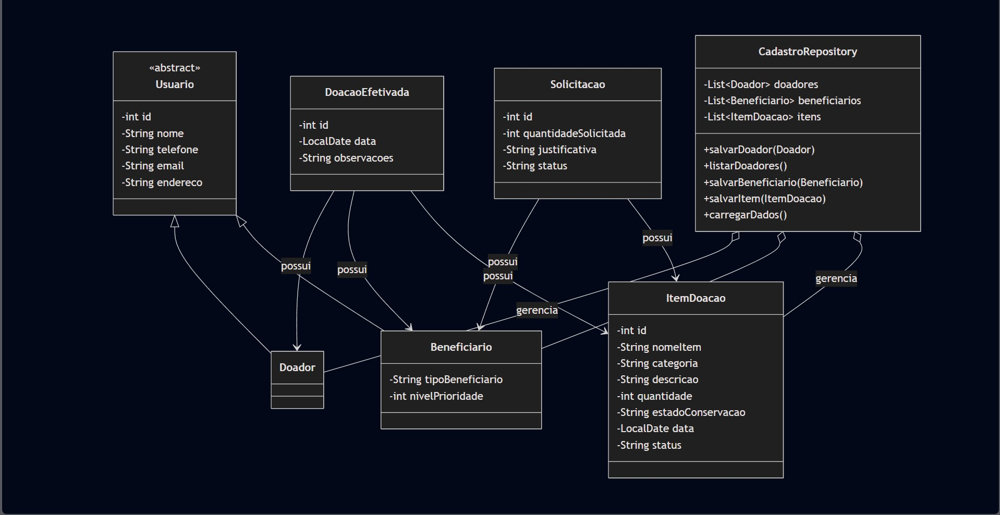
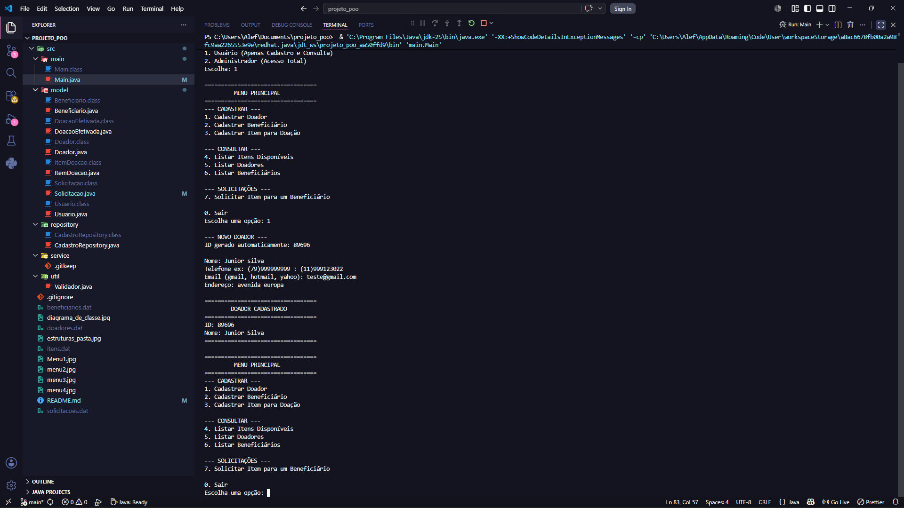
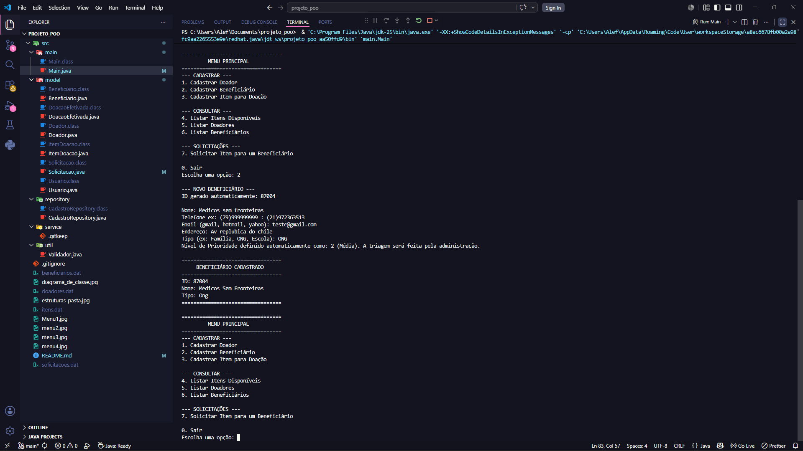
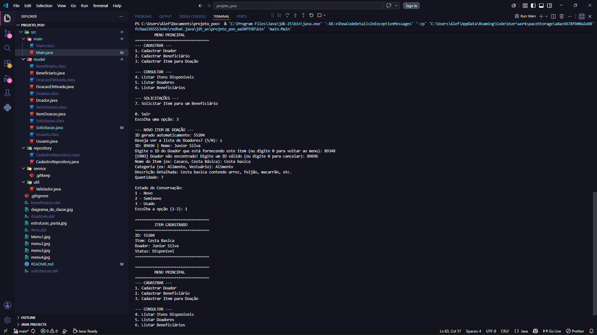
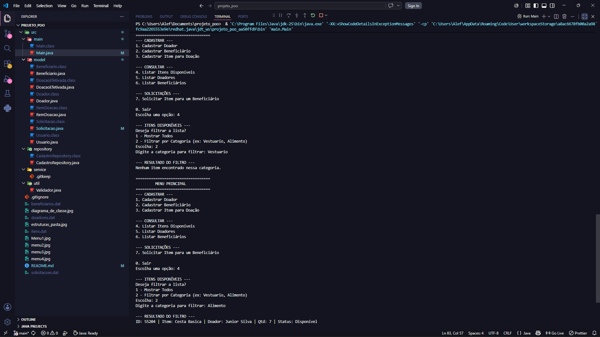
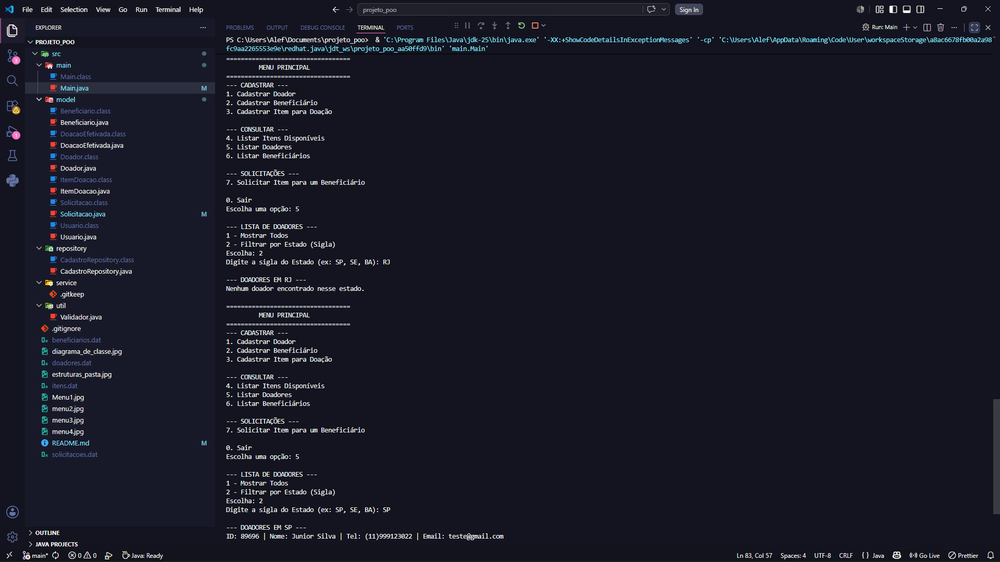
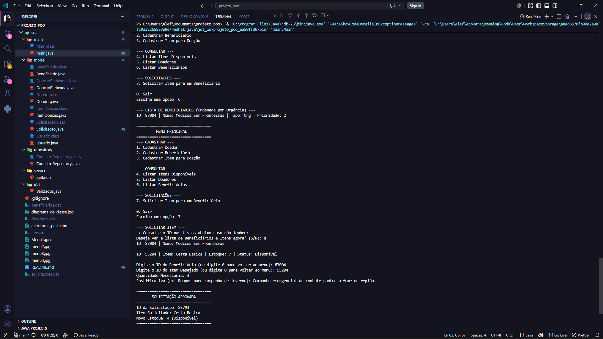
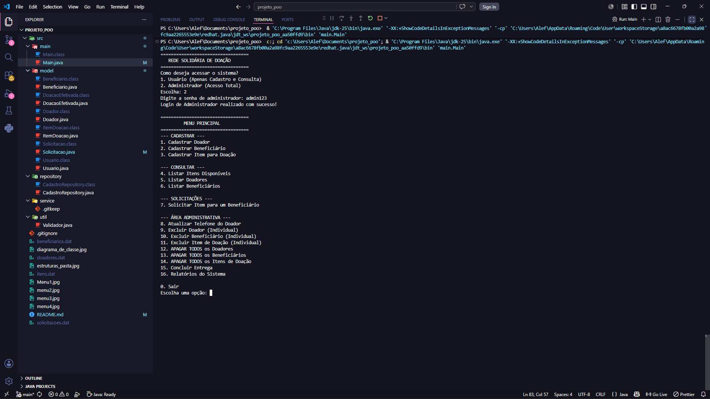
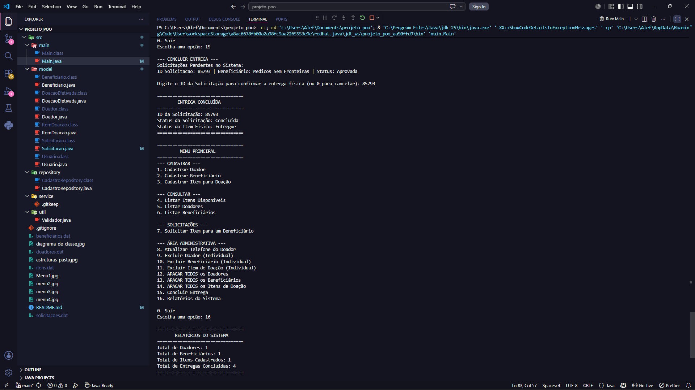

# 🤝 Rede Solidária de Doação - Java POO

Aplicação orientada a objetos desenvolvida em Java para apoiar o cadastro e gerenciamento de itens doados para pessoas e instituições em situação de necessidade.

O sistema conecta doadores e beneficiários, auxiliando no reaproveitamento de recursos e contribuindo com os seguintes Objetivos de Desenvolvimento Sustentável (ODS) da ONU:

- ODS 1 — Erradicação da Pobreza
- ODS 2 — Fome Zero
- ODS 10 — Redução das Desigualdades
- ODS 12 — Consumo e Produção Responsáveis

Projeto desenvolvido para fins acadêmicos — **Foco: Checkpoint 2**.

---

# ✨ Funcionalidades do Sistema (Checkpoint 2)

## Cadastro
- Cadastro de Doadores
- Cadastro de Beneficiários
- Cadastro de Itens para Doação

## Consultas e Filtros
- Listagem de itens disponíveis
- Filtro de itens por categoria
- Listagem de doadores
- Filtro de doadores por estado
- Listagem de beneficiários ordenados por prioridade

## Sistema de Solicitações
- Beneficiários podem solicitar itens
- Controle automático de estoque
- Atualização automática do status dos itens
- Registro de solicitações aprovadas

## Área Administrativa
- Login administrativo
- Atualização de telefone de doadores
- Exclusão individual de registros
- Exclusão total de registros
- Conclusão de entregas
- Relatórios do sistema

## Persistência Automática
- Salvamento automático em arquivos `.dat`
- Carregamento automático ao iniciar o sistema

## Validações
- Verificação de email duplicado
- Validação de telefone
- Controle de quantidade mínima
- Geração automática de IDs únicos

---

# 📊 Diagrama de Classes (Modelagem)



---

# 🚀 Como usar

## Pré-requisitos
Ter o Java (JDK) instalado na máquina.

## Clone o projeto

```bash
git clone https://github.com/Alefsantos186/RedeSolidariaJava.git
cd RedeSolidariaJava/src
```

## Compile os arquivos Java

```bash
javac main/*.java model/*.java repository/*.java util/*.java
```

## Execute o sistema

```bash
java main.Main
```

---

# 📝 Exemplo do Menu Principal

```text
==================================
   REDE SOLIDÁRIA DE DOAÇÃO
==================================

1. Usuário
2. Administrador

--- CADASTRAR ---
1. Cadastrar Doador
2. Cadastrar Beneficiário
3. Cadastrar Item para Doação

--- CONSULTAR ---
4. Listar Itens Disponíveis
5. Listar Doadores
6. Listar Beneficiários

--- SOLICITAÇÕES ---
7. Solicitar Item

--- ÁREA ADMINISTRATIVA ---
8. Atualizar Telefone do Doador
9. Excluir Doador
10. Excluir Beneficiário
11. Excluir Item
12. Apagar Todos os Doadores
13. Apagar Todos os Beneficiários
14. Apagar Todos os Itens
15. Concluir Entrega
16. Relatórios do Sistema

0. Sair
```

---

# 💾 Persistência Local

Ao encerrar o sistema, todos os dados são salvos automaticamente em arquivos `.dat` locais utilizando serialização de objetos.

Ao iniciar novamente o programa, os dados anteriores são carregados automaticamente.

---

# 📂 Estrutura do Projeto

```text
src/
├── model/
│   ├── Usuario.java
│   ├── Doador.java
│   ├── Beneficiario.java
│   ├── ItemDoacao.java
│   └── Solicitacao.java
│ 
├── repository/
│   └── CadastroRepository.java
│ 
├── service/
│ 
├── util/
│   └── Validador.java
│ 
└── main/
    └── Main.java
```

---

# 🧠 Conceitos de POO Utilizados

- Encapsulamento
- Herança
- Organização em camadas
- Persistência de objetos
- Serialização
- Collections Framework
- Streams API
- Validação de dados
- Manipulação de arquivos

---

# 📸 Evidências de Funcionamento (Checkpoint 2)

## Estrutura de Pastas do Projeto



---

## 1. Login e Menu Principal



---

## 2. Cadastro de Doador



---

## 3. Cadastro de Beneficiário



---

## 4. Cadastro de Item para Doação



---

## 5. Solicitação de Item



---

## 6. Conclusão de Entrega



---

## 7. Relatórios do Sistema



---

# 🛠️ Tecnologias Utilizadas

- Java
- Programação Orientada a Objetos (POO)
- Scanner
- ArrayList
- Streams API
- Serialização de Objetos
- ObjectOutputStream / ObjectInputStream
- Persistência local com arquivos `.dat`

---

