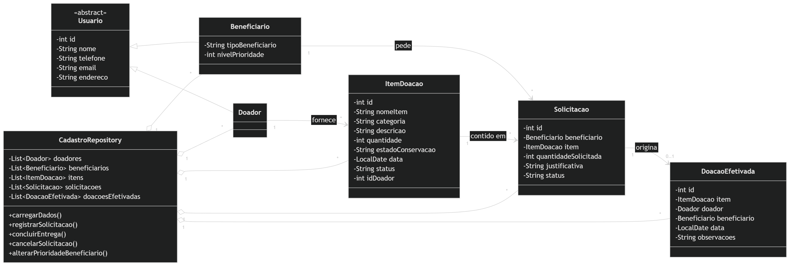

# 🤝 Rede Solidária de Doação - Java POO

Aplicação orientada a objetos desenvolvida em Java para apoiar o cadastro, gerenciamento e distribuição de itens doados para pessoas e instituições em situação de necessidade.

O sistema conecta doadores e beneficiários, promovendo o reaproveitamento de recursos e contribuindo para os Objetivos de Desenvolvimento Sustentável (ODS) da ONU.

Versão final do projeto acadêmico desenvolvido para a disciplina de Programação Orientada a Objetos.

---

## 🌎 ODS Atendidos

A aplicação foi projetada para mitigar problemas sociais através da tecnologia, atuando diretamente em quatro metas globais da Agenda 2030 da ONU:

* **ODS 1 — Erradicação da Pobreza:** Facilita a organização de fluxos de doações de insumos básicos para comunidades carentes.
* **ODS 2 — Fome Zero:** Agiliza a triagem e o repasse de alimentos não perecíveis e cestas básicas para instituições e famílias.
* **ODS 10 — Redução das Desigualdades:** O algoritmo de triagem permite priorizar o atendimento de beneficiários conforme o nível de urgência social.
* **ODS 12 — Consumo e Produção Responsáveis:** Combate o desperdício através da economia circular, permitindo que móveis, roupas e materiais em bom estado ganhem um novo ciclo de vida útil.

---

## ✨ Funcionalidades do Sistema (Checkpoint 3)

### Cadastro

* Cadastro de Doadores
* Cadastro de Beneficiários
* Cadastro de Itens para Doação

### Consultas e Filtros

* Listagem de itens disponíveis
* Filtro de itens por categoria validada
* Listagem de doadores com identificação de estado via DDD
* Listagem de beneficiários ordenados por prioridade

### Sistema de Solicitações

* Solicitação de itens por beneficiários
* Controle automático de estoque impedindo pedidos acima do limite
* Atualização automática de status dos itens
* Registro de solicitações aprovadas

### Gestão de Entregas

* Conclusão de entregas com geração de DoacaoEfetivada
* Cancelamento de solicitações com devolução automática de estoque
* Proteção contra exclusão de registros vinculados a operações ativas

### Área Administrativa

* Login administrativo protegido por senha
* Atualização de telefone de doadores
* Alteração dinâmica de prioridade de beneficiários
* Relatórios analíticos utilizando Java Stream API

---

## 📊 Diagrama de Classes (UML)



---

## 🚀 Como Executar o Sistema

### Pré-requisitos

É necessário possuir o Java JDK instalado na máquina.

### Clonar o repositório

```bash
git clone https://github.com/Alefsantos186/RedeSolidariaJava.git
cd RedeSolidariaJava/src
```

### Compilar o projeto

```bash
javac main/*.java model/*.java repository/*.java util/*.java
```

### Executar o sistema

```bash
java main.Main
```

---

## 🔐 Acesso Administrativo

O sistema possui dois níveis de acesso:

```text
1. Usuário
2. Administrador
```

Para acessar as funcionalidades administrativas, selecione a opção **Administrador** e informe a senha:

```text
admin123
```

A área administrativa permite:

* Atualizar telefone de doadores
* Alterar prioridade de beneficiários
* Concluir entregas
* Cancelar solicitações
* Consultar relatórios administrativos
* Gerenciar registros do sistema

---

## 💾 Persistência Local

O sistema utiliza serialização nativa de objetos Java para persistir os dados em arquivos binários `.dat` locais.

* Os dados são carregados automaticamente na inicialização do programa.
* Toda operação de cadastro, atualização, entrega ou cancelamento realiza salvamento automático, garantindo integridade das informações.

---

## 📂 Estrutura do Projeto

```text
src/
├── model/
│   ├── Usuario.java
│   ├── Doador.java
│   ├── Beneficiario.java
│   ├── ItemDoacao.java
│   ├── Solicitacao.java
│   └── DoacaoEfetivada.java
│
├── repository/
│   └── CadastroRepository.java
│
├── util/
│   └── Validador.java
│
└── main/
    └── Main.java
```

---

## 🧠 Conceitos de POO e Tecnologias Utilizadas

### Abstração e Encapsulamento

Modelagem de classes de domínio com atributos protegidos e acesso controlado por métodos.

### Herança e Polimorfismo

Classe abstrata `Usuario` especializada pelas subclasses `Doador` e `Beneficiario`.

### Collections Framework

Utilização de `List` e `ArrayList` para gerenciamento dinâmico dos dados.

### Stream API

Filtros, ordenações, agrupamentos e geração de relatórios administrativos estruturados.

### Persistência Binária

Manipulação de arquivos utilizando as classes nativas:

* ObjectOutputStream
* ObjectInputStream

---

## 📈 Relatórios Administrativos Disponíveis

Através do menu do administrador, o gestor possui acesso a painéis estatísticos baseados em Streams:

* Quantidade total de doadores
* Quantidade total de beneficiários
* Quantidade total de itens
* Quantidade total de solicitações
* Quantidade total de entregas concluídas
* Itens agrupados por categoria
* Doadores agrupados por estado
* Ranking de itens mais solicitados
* Ranking de beneficiários mais atendidos
* Histórico de doações efetivadas

---

## 👥 Relatório de Colaboração (Desenvolvimento Solo)

Em atendimento aos requisitos acadêmicos de entrega, este projeto foi desenvolvido integralmente por um único integrante.

O autor assumiu de maneira autônoma todas as etapas do ciclo de desenvolvimento do software:

* **Arquiteto de Software:** Responsável pela modelagem UML, estrutura das classes e definição das regras de negócio.
* **Desenvolvedor Backend:** Responsável pela implementação das funcionalidades, persistência, validações e relatórios.
* **Analista de Qualidade (QA):** Responsável pelos testes de funcionamento, validação de entradas e verificação de regras de negócio.
* **DevOps / GitHub:** Responsável pelo controle de versões, gerenciamento de branches, commits, merges e organização do repositório.

---

## 🌍 Impacto Social

A plataforma busca organizar o processo de doação de recursos para famílias, ONGs e instituições em situação de vulnerabilidade.

O sistema promove a reutilização de itens, reduz desperdícios e contribui para uma distribuição mais eficiente de recursos, alinhando tecnologia e responsabilidade social.

---

## 👨‍💻 Autor

**Alef Santos**

